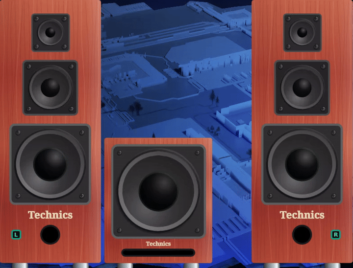

# ScreenSpeaker-plasmoid
Shows animated virtual speakers as a kde plasmoid.

# How to use
 - For stereo speakers add 2 instances of the plasmoid and use the channel selction lindicator that shows up just next to the Techics logo.
 - To make the speakers the same size, use the size config.

